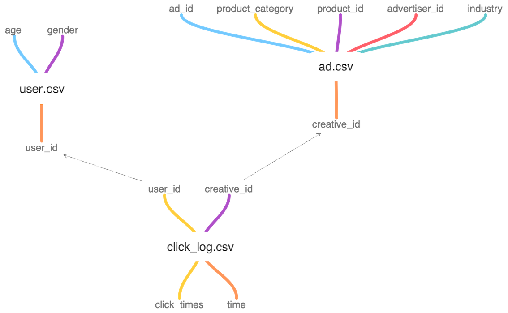

# TAAC2020
腾讯广告算法大赛2020

#### 注意的点

- 尝试新的思路用1/10的数据集跑模型，快速验证模型是否work，摸摸模型的底。

# 代码结构

```bash
.
├── img/
├── data/               # 训练和测试数据
├── Dense_LSTM_embedding_128_dim.py # 对于128维word2vec特征使用Dense和LSTM模型
├── get_user_embed_multiprocess.py  # 使用多进程合并特征(不再使用)
├── LICENSE
├── LightGMB.py         # LightGBM baseline
├── LightGBM.py         # 使用最原始的id作为特征
├── LightGBM_embedding_128_dim.py   # 使用word2vec平均后的128维特征作为特征作为特征输入LGBM
├── LightGBM_embedding_16_dim.py    # 同上，维度变为16
├── LightGBM_gender.py  # 使用word2vec平均后的128维特征作为特征输入LSTM预测gender
├── LightGBM_age.py     # 同上，预测age
├── LSTM_gender.py      # 对于word2vec序列特征输入LSTM预测gender
├── LSTM_age.py         # 同上，预测age
├── mail.py             # 训练完发邮件给自己
├── README.md
├── tf_idf              # 提取tf-idf特征
├── word2vec/           # 保存word2vec生成的向量和中间文件
├── word2vec_creaitve_id.py         # 生成用户关于creative id的embedding vector
├── process_data.ipynb  # 将训练集ad.csv、user.csv合并到click_log.csv，测试集中的ad.csv合并到click_log.csv
├── 腾讯广告算法大赛.pdf   # 比赛说明文档
└── tmp                 # 临时文件
```
# TODO

- [x] 传统机器学习如随机森林、决策树、SVM、朴素贝叶斯、贝叶斯网络、逻辑回归、AdaBoost等 (accuracy < 1.0，随机森林：0.89)
- [ ] 直接对category feature和numeric feature使用全连接网络
- [x] LightGBM
    - [x] +Voting (accuracy: 0.91)
    - [ ] +LightGBM
    - [ ] +RNN
- [x] 处理成序列问题后，使用word2vec生成词嵌入后
    - [x] +LightGBM (accuraty: 0.8)
    - [x] 3个特征+Dense (**accuracy: 1.05**)
    - [x] 6个128维特征+Conv 1D (**accuracy: 1.15**)
    - [x] 6个128维特征+Dense (**accuracy: 1.20**)
    - [x] +RNN等序列模型 (training)
- [ ] GNN生成user_id creative_id ad_id等的词嵌入后分类
    - [ ] +Dense
    - [ ] +RNN等序列模型
    - [ ] +LightGBM
- [x] TF-IDF
    - [x] min_df=30 + LightGBM (**accuracy: 1.30**)
    - [x] +Dense (**accuracy: 1.22**)
- [ ] DeepFM、DeepFFM等
- [ ] 集成学习：比赛最后阶段使用上分

## 处理成序列问题

把每个点击的creative_id或者ad_id当作一个词，把一个人90天内点击的creative_id或者ad_id列表当作一个句子，使用word2vec来构造creative_id或者ad_id嵌入表示。最后进行简单的统计操作得到用户的向量表示。这种序列简单聚合导致信息损失，显得是非常的粗糙，需要进一步引入attention等方法。

上述方法可以直接使用传统的GBDT相关模型进行，1.3应该没问题。下面可以考虑序列建模方式。例如RNN/LSTM/GRU，这类方法将用户行为看做一个序列，套用NLP领域常用的RNN/LSTM/GRU方法来进行建模。

## TF-IDF

NLP中常用的做法，将用户点击序列中的creative_id或者ad_id集合看作一篇文档，将每个creative_id或者ad_id视为文档中的文字，然后使用tfidf。当然这也下来维度也非常高，可以通过参数调整来降低维度，比如sklearn中的TfidfVectorizer，可以使用max_df和min_df进行调整。
- df(document frequency)：某一个creative_id在所有用户的creative_id序列出现的频率。

## DeepFM、DeepFFM、xDeepFM

推荐系统常用架构。

## GNN

将用户的访问记录看作图，利用图神经网络提取user_id、creative_id、ad_id等的Embedding，利用提取的Embedding输入下游模型，或者将访问记录看作序列输入序列模型。

## 集成学习

最终融合多个模型使用。


# 数据探索

给定的三个训练数据文件`user.csv ad.csv click_log.csv`的文件和外键关系如下：
- `ad.csv`中一个素材id只能对应一个广告id，一个广告id对应多个素材id



测试集和训练集中ad.csv中：相同的ID占比：
```python
len(set(ad_test.advertiser_id.values.tolist()) & set(ad_train.advertiser_id.values.tolist()))/len(set(ad_test.advertiser_id.values.tolist()) | set(ad_train.advertiser_id.values.tolist()))
```
```
- product_id: 0.73
- creative_id: 0.49
- product_category: 1.0
- advertiser_id: 0.81
- industry: 0.96
```

- 训练集用户id最小值和最大值：(1, 900000)
- 测试集用户id最小值和最大值：(3000001, 4000000)
- 测试集和训练集共有user_id：1900000，其中训练集900000，测试集1000000
- 训练集和测试集共有唯一的cretive_id数：2481135

# 获得训练数据
- `process_data.ipynb`将三个文件按照外键合并成一个文件，把`process_data.ipynb`中的数据路径修改一下即可。

合并之后的数据：


# 训练记录

- age和gender是随机的，提交准确率0.66
- age和gender都为1，提交准确率0.707
- LightGBM的baseline训练10和50个epoch，提交准确率均为0.91，其中age准确率0.22582、gender准确率0.687186。
- word2vec处理creative_id product_category industry序列做平均后作为用户embedding送入Dense后accuracy: 1.05